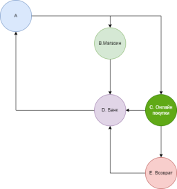

# Начисление бонусов за покупку
## Условия 

У клиента банка есть безналичные(A) средства, которыми он расплачивается в Магазине(B) и совершая Онлайн Покупки(С). Банк(D) начисляет бонусы в виде 10% в (B) и 17% в (C).
Покупки менее 20 рублей возвращаются комиссией 10% в Банк(D), пройдя поле Возврат(E), иначе начисляются бонусы равные 30% от суммы, если сумма покупки более 300 рублей. 

**Задача**  
Написать REST контроллеры:
1. Оплата покупки - GET /api/payment/{Shop|Online}/{amount}
2. Количество бонусов на счете банка - GET /api/bankAccountOfEMoney
3. Количество безналичных денег - GET /api/money

## Моя реализация

У клиента имеется аккаунт в банке. В аккануте 2 счета - счет безналичных денег и счет бонусов.
### Покупка в магазине
При покупке в магазине, всегда начиляем бонусы в виде 10%  
Так как на схеме поле Возврат относится только к онлайн покупкам, значит условия на комиссию и повышенный бонус для оплаты в магазине не применяем.

### Покупка онлайн
Если сумма покупки < 20 рублей, то взимаем дополнительно комиссию в размере 10% от суммы покупки и бонусы не добавляем  
Если сумма покупки >= 20, но < 300, то начисляем бонус 17%.  
Если сумма покупки >= 300, то начисляем бонус 30%